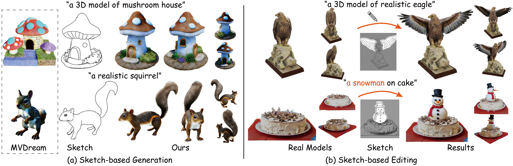

# SketchDream: Sketch-based Text-to-3D Generation and Editing<br><sub>Official implementation</sub>

| [Project Page](http://geometrylearning.com/SketchDream/) | [Paper](https://arxiv.org/pdf/2405.06461) |



## Installation

### Install threestudio

**This part is the same as original threestudio. Skip it if you already have installed the environment.**

See [installation.md](docs/installation.md) for additional information, including installation via Docker.

- We test our code on an NVIDIA graphics card with 80GB VRAM and have [CUDA](https://developer.nvidia.com/cuda-downloads) installed.
- Install `Python >= 3.8`.
- (Optional, Recommended) Create a virtual environment:

```sh
python3 -m virtualenv sketchDream
. sketchDream/bin/activate

# Newer pip versions, e.g. pip-23.x, can be much faster than old versions, e.g. pip-20.x.
# For instance, it caches the wheels of git packages to avoid unnecessarily rebuilding them later.
python3 -m pip install --upgrade pip
```

- Install `PyTorch >= 1.12`. We have tested on `torch1.12.1+cu113`, but other versions should also work fine.

```sh
# torch1.12.1+cu113
pip install torch==1.12.1+cu113 torchvision==0.13.1+cu113 --extra-index-url https://download.pytorch.org/whl/cu113
```

- (Optional, Recommended) Install ninja to speed up the compilation of CUDA extensions:

```sh
pip install ninja
```

- Install dependencies:

```sh
pip install -r requirements.txt
```


## Quickstart

Download the pretrained models from [HuggingFace Model Page](https://huggingface.co/Okrin/sketch-to-multiview/tree/main/) and put in into the folder "models".

### Sketch-based 3D Generation

We provide three test examples. Simply run: 

```sh
./scripts/golden_fish.sh
```

If you want to test your own sketches, see `./tools/depth_predict.py` and `./scripts/depth_predict.sh` to generate corresponding depth maps. You may need to try different seeds to generate satisfactory depth maps. 

### Sketch-based 3D Editing
We provide two test examples for refine editing stage. Download the data from [Google_Drive](https://drive.google.com/drive/folders/1NLskbTx-ApyvJotrB0z0W4_EimHZs3WU?usp=sharing) and unzip them into `./asserts/`. Then,  run:

```sh
./scripts/bark_editing/run_refine_editing.sh
```

If you want to get the coarse editing results, simply run:

```sh
./scripts/bark_editing/run_coarse_editing.sh
```

We will release more examples soon.

## Tips
- For sketch-based generation, the hyperparameters can be tuned to generate the best results. If you pefer to generate higher quality objects instead of more sketch faithfulness, increase the "Diffusion_2D_prob" and reduce the "lambda_mask". If you pefer to generate more sketch faithful results, doing verse vice or set "four_view" as False. 
- If the memory is limited, you can turn off the soft-shading as in [MVDream-project](https://github.com/bytedance/MVDream-threestudio) and reduce the resolution.
- We are so sorry that the current complete editing process is complicated for your own 3D models. You should manually draw the editing sketches and predict the depth maps. The model_mask_edit.obj (extracted from the coarse editing process) should be manually corrected by meshlab if you want to get the best refine editing results. For refinement stage, the parameters should be carefully checked, as underscored in yaml file.


## Credits

This code is built on the [threestudio-project](https://github.com/threestudio-project/threestudio), [MVDream-project](https://github.com/bytedance/MVDream-threestudio), and [pose-warping](https://github.com/NagabhushanSN95/Pose-Warping). Thanks to the maintainers for their contribution to the community!

## Citing

If you find MVDream helpful, please consider citing:

```
@article {SketchDream2024,
    author = {Liu, Feng-Lin and Fu, Hongbo and Lai, Yu-Kun and Gao, Lin},
    title = {SketchDream: Sketch-based Text-to-3D Generation and Editing},
    journal = {ACM Transactions on Graphics (Proceedings of ACM SIGGRAPH 2024)},
    year = {2024},
    volume = 43,
    number = 4
}
```
