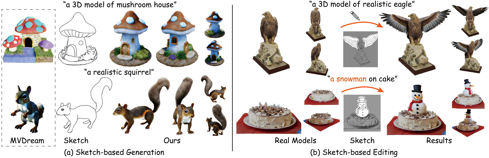

# SketchDream: Sketch-based Text-to-3D Generation and Editing<br><sub>Official implementation</sub>



## Abstract
Existing text-based 3D generation methods generate attractive results but lack detailed geometry control. Sketches, known for their conciseness and expressiveness, have contributed to intuitive 3D modeling but are confined to producing texture-less mesh models within predefined categories. Integrating sketch and text simultaneously for 3D generation promises enhanced control over geometry and appearance but faces challenges from 2D-to-3D translation ambiguity and multi-modal condition integration. Moreover, further editing of 3D models in arbitrary views will give users more freedom to customize their models. However, it is difficult to achieve high generation quality, preserve unedited regions, and manage proper interactions between shape components. To solve the above issues, we propose a text-driven 3D content generation and editing method, SketchDream, which supports NeRF generation from given hand-drawn sketches and achieves free-view sketch-based local editing. To tackle the 2D-to-3D ambiguity challenge, we introduce a sketch-based multi-view image generation diffusion model, which leverages depth guidance to establish spatial correspondence. A 3D ControlNet with a 3D attention module is utilized to control multi-view images and ensure their 3D consistency. To support local editing, we further propose a coarse-to-fine editing approach: the coarse phase analyzes component interactions and provides 3D masks to label edited regions, while the fine stage generates realistic results with refined details by local enhancement. Extensive experiments validate that our method generates higher-quality results compared with a combination of 2D ControlNet and image-to-3D generation techniques and achieves detailed control compared with existing diffusion-based 3D editing approaches.

## Code

Coming soon

## Citation
```
@article {SketchDream2024,
    author = {Liu, Feng-Lin and Fu, Hongbo and Lai, Yu-Kun and Gao, Lin},
    title = {SketchDream: Sketch-based Text-to-3D Generation and Editing},
    journal = {ACM Transactions on Graphics (Proceedings of ACM SIGGRAPH 2024)},
    year = {2024},
    volume = 43,
    number = 4
}
```
